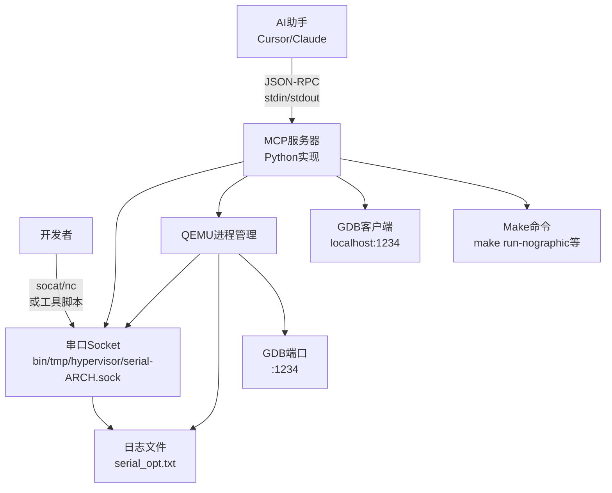

# DragonOS MCP服务器设计方案（Python实现

）

## 1. 架构概述

使用Python实现符合MCP (Model Context Protocol) 标准的服务器，为AI助手提供与DragonOS虚拟机交互的能力。**关键特性**：

- 串口socket存放在 `bin/tmp/hypervisor/` 目录
- 支持多个客户端同时连接（MCP服务器 + 开发者终端）
- Python实现，易于维护和扩展

### 架构图




## 2. 目录结构

```javascript
tools/mcp-server/
├── pyproject.toml          # Python项目配置
├── requirements.txt        # 依赖项
├── README.md              # 使用文档
├── src/
│   └── dragonos_mcp/
│       ├── __init__.py
│       ├── server.py      # MCP服务器主程序
│       ├── mcp/
│       │   ├── __init__.py
│       │   ├── protocol.py # MCP协议实现
│       │   └── tools.py    # 工具定义和注册
│       ├── qemu/
│       │   ├── __init__.py
│       │   ├── process.py  # QEMU进程管理
│       │   └── monitor.py  # QEMU Monitor交互
│       ├── serial/
│       │   ├── __init__.py
│       │   ├── client.py   # 串口socket客户端（只读）
│       │   └── parser.py   # 输出解析
│       ├── gdb/
│       │   ├── __init__.py
│       │   ├── client.py   # GDB客户端
│       │   └── analyzer.py # 调用栈分析
│       └── test/
│           ├── __init__.py
│           └── runner.py   # 测试执行
├── scripts/
│   ├── connect-serial.sh  # 开发者连接脚本
│   └── install.sh         # 安装脚本
└── tests/
    └── test_basic.py      # 基础测试

bin/tmp/hypervisor/        # 运行时目录（自动创建）
├── serial-x86_64.sock     # 串口socket
├── monitor-x86_64.sock    # QEMU monitor socket
└── .gitkeep
```


## 3. 核心功能模块

### 3.1 QEMU虚拟机管理

#### 3.1.1 进程管理

- **启动虚拟机**：执行 `make run-nographic`，后台运行QEMU进程
- **停止虚拟机**：优雅终止QEMU进程（先TERM，必要时KILL）
- **状态监控**：检测QEMU进程是否运行，监控启动状态
- **进程管理**：跟踪QEMU PID，管理子进程

#### 3.1.2 Socket路径管理

- Socket文件存放在 `bin/tmp/hypervisor/` 目录
- 格式：`serial-${ARCH}.sock` 和 `monitor-${ARCH}.sock`
- 启动前确保目录存在，清理旧socket文件

### 3.2 串口交互模块

#### 3.2.1 QEMU串口Socket配置

修改 `tools/run-qemu.sh`，在nographic模式下使用unix socket：

```bash
if [ ${QEMU_NOGRAPHIC} == true ]; then
    # 创建socket目录
    SOCKET_DIR="../bin/tmp/hypervisor"
    mkdir -p "${SOCKET_DIR}"
    
    # 串口socket路径
    QEMU_SERIAL_SOCK="${SOCKET_DIR}/serial-${ARCH}.sock"
    QEMU_MONITOR_SOCK="${SOCKET_DIR}/monitor-${ARCH}.sock"
    
    # 清理旧的socket文件
    rm -f "${QEMU_SERIAL_SOCK}" "${QEMU_MONITOR_SOCK}"
    
    # 配置串口：使用unix socket，支持多客户端，同时写入日志文件
    QEMU_SERIAL=" -serial chardev:serial0 "
    QEMU_SERIAL+=" -chardev socket,id=serial0,path=${QEMU_SERIAL_SOCK},server,nowait,logfile=${QEMU_SERIAL_LOG_FILE} "
    
    # 配置monitor：使用独立的unix socket
    QEMU_MONITOR=" -monitor unix:${QEMU_MONITOR_SOCK},server,nowait "
    
    # 添加 virtio console 设备
    if [ ${ARCH} == "x86_64" ]; then
      QEMU_DEVICES+=" -device virtio-serial -device virtconsole,chardev=serial0 "
    elif [ ${ARCH} == "loongarch64" ]; then
      QEMU_DEVICES+=" -device virtio-serial -device virtconsole,chardev=serial0 "
    elif [ ${ARCH} == "riscv64" ]; then
      QEMU_DEVICES+=" -device virtio-serial-device -device virtconsole,chardev=serial0 "
    fi
    
    KERNEL_CMDLINE=" console=/dev/hvc0 ${KERNEL_CMDLINE}"
    QEMU_ARGUMENT+=" --nographic "
    # ... 其他配置 ...
fi
```


#### 3.2.2 Python串口客户端实现

```python
# src/dragonos_mcp/serial/client.py
import socket
import select
import os
from pathlib import Path
from typing import Optional

class SerialClient:
    """串口socket客户端（只读模式）"""
    
    def __init__(self, socket_path: str):
        self.socket_path = Path(socket_path)
        self.sock: Optional[socket.socket] = None
        self.connected = False
    
    def connect(self) -> bool:
        """连接到串口socket"""
        if not self.socket_path.exists():
            return False
        
        try:
            self.sock = socket.socket(socket.AF_UNIX, socket.SOCK_STREAM)
            self.sock.connect(str(self.socket_path))
            self.connected = True
            return True
        except Exception as e:
            print(f"连接失败: {e}")
            return False
    
    def read_output(self, timeout: float = 1.0) -> Optional[str]:
        """读取输出（非阻塞）"""
        if not self.connected or not self.sock:
            return None
        
        ready, _, _ = select.select([self.sock], [], [], timeout)
        if ready:
            try:
                data = self.sock.recv(4096)
                return data.decode('utf-8', errors='ignore')
            except Exception as e:
                print(f"读取失败: {e}")
                self.connected = False
                return None
        return None
    
    def disconnect(self):
        """断开连接"""
        if self.sock:
            self.sock.close()
            self.sock = None
        self.connected = False
```


### 3.3 GDB调试集成

使用Python的 `pexpect` 或直接通过socket连接GDB：

```python
# src/dragonos_mcp/gdb/client.py
import socket
import re
from typing import List, Dict, Optional

class GDBClient:
    """GDB客户端，连接到localhost:1234"""
    
    def __init__(self):
        self.sock: Optional[socket.socket] = None
        self.connected = False
    
    def connect(self, host: str = "localhost", port: int = 1234) -> bool:
        """连接到GDB服务器"""
        try:
            self.sock = socket.socket(socket.AF_INET, socket.SOCK_STREAM)
            self.sock.connect((host, port))
            self.connected = True
            return True
        except Exception as e:
            print(f"GDB连接失败: {e}")
            return False
    
    def send_command(self, command: str) -> str:
        """发送GDB命令"""
        if not self.connected:
            return ""
        # 实现GDB远程协议命令发送
        # ...
    
    def get_backtrace(self, thread_id: Optional[int] = None) -> List[Dict]:
        """获取调用栈"""
        # 实现bt命令执行和解析
        # ...
```


### 3.4 测试执行管理

通过QEMU monitor发送键盘输入来执行命令：

```python
# src/dragonos_mcp/test/runner.py
import json
import socket
from pathlib import Path

class TestRunner:
    """测试执行器"""
    
    def __init__(self, monitor_socket_path: str):
        self.monitor_socket = Path(monitor_socket_path)
        self.monitor_conn: Optional[socket.socket] = None
    
    def send_command(self, command: str) -> str:
        """通过QEMU monitor发送命令"""
        # 使用QMP或monitor协议发送命令
        # 例如：sendkey命令模拟键盘输入
        # ...
    
    def run_test(self, test_path: str, test_dir: str = "/opt/tests/gvisor") -> Dict:
        """执行测试"""
        # 1. cd到测试目录
        # 2. 执行测试程序
        # 3. 收集输出
        # ...
```


## 4. MCP工具定义

### 4.1 虚拟机控制工具

#### `dragonos_vm_start`

启动DragonOS虚拟机

- 参数：
- `arch` (string, 可选): 架构，默认 "x86_64"
- `timeout` (number, 可选): 启动超时（秒），默认 300
- 返回：
- `pid` (number): QEMU进程ID
- `status` (string): 启动状态
- `serial_socket` (string): 串口socket路径
- `monitor_socket` (string): Monitor socket路径

#### `dragonos_vm_stop`

停止DragonOS虚拟机

- 参数：
- `force` (boolean, 可选): 是否强制终止，默认 false
- 返回：
- `success` (boolean): 是否成功
- `message` (string): 状态消息

#### `dragonos_vm_status`

查询虚拟机状态

- 返回：
- `running` (boolean): 是否运行
- `pid` (number, 可选): 进程ID
- `boot_completed` (boolean): 是否启动完成
- `serial_socket` (string): 串口socket路径
- `last_output` (string): 最后输出片段

#### `dragonos_vm_get_serial_path`

获取串口socket路径

- 返回：
- `socket_path` (string): socket路径
- `connect_command` (string): 连接命令示例

### 4.2 串口交互工具

#### `dragonos_serial_read`

读取串口输出

- 参数：
- `lines` (number, 可选): 读取行数，默认 100
- `timeout` (number, 可选): 超时（秒），默认 5
- `pattern` (string, 可选): 匹配模式（正则表达式）
- 返回：
- `output` (string): 输出内容
- `matched` (boolean): 是否匹配到pattern

#### `dragonos_wait_boot`

等待系统启动完成

- 参数：
- `timeout` (number, 可选): 超时（秒），默认 300
- 返回：
- `booted` (boolean): 是否启动完成
- `boot_time` (number): 启动耗时（秒）

### 4.3 测试执行工具

#### `dragonos_test_run`

在虚拟机内执行测试

- 参数：
- `test_path` (string): 测试程序路径，如 "/opt/tests/gvisor/socket_test"
- `test_dir` (string, 可选): 工作目录，默认 "/opt/tests/gvisor"
- `timeout` (number, 可选): 超时（秒），默认 600
- 返回：
- `success` (boolean): 是否成功
- `output` (string): 测试输出
- `result` (object): 解析后的测试结果

#### `dragonos_test_list`

列出可用测试

- 参数：
- `test_dir` (string, 可选): 测试目录，默认 "/opt/tests/gvisor"
- 返回：
- `tests` (array): 测试列表

### 4.4 GDB调试工具

#### `dragonos_gdb_backtrace`

获取调用栈

- 参数：
- `thread_id` (number, 可选): 线程ID，默认所有线程
- `full` (boolean, 可选): 是否包含局部变量，默认 false
- 返回：
- `threads` (array): 线程列表
- `backtraces` (object): 每个线程的调用栈

#### `dragonos_gdb_analyze`

分析卡死原因

- 返回：
- `analysis` (string): 分析结果
- `type` (string): 问题类型（deadlock/wait/other）
- `suggestions` (array): 建议

## 5. Python依赖项

### requirements.txt

```javascript
mcp>=1.0.0              # MCP协议库
psutil>=5.9.0           # 进程管理
pexpect>=4.8.0          # 进程交互（GDB）
watchdog>=3.0.0         # 文件监控
```


### pyproject.toml

```toml
[project]
name = "dragonos-mcp"
version = "0.1.0"
description = "MCP server for DragonOS VM interaction"
requires-python = ">=3.8"
dependencies = [
    "mcp>=1.0.0",
    "psutil>=5.9.0",
    "pexpect>=4.8.0",
    "watchdog>=3.0.0",
]

[build-system]
requires = ["setuptools>=61.0"]
build-backend = "setuptools.build_meta"
```


## 6. 开发者终端访问

### 6.1 连接脚本

创建 `tools/mcp-server/scripts/connect-serial.sh`：

```bash
#!/bin/bash
# 连接到DragonOS串口终端

ARCH=${ARCH:-x86_64}
SOCKET_PATH="bin/tmp/hypervisor/serial-${ARCH}.sock"
PROJECT_ROOT=$(git rev-parse --show-toplevel 2>/dev/null || pwd)

if [ ! -S "$PROJECT_ROOT/$SOCKET_PATH" ]; then
    echo "错误: 串口socket不存在: $PROJECT_ROOT/$SOCKET_PATH"
    echo "请确保DragonOS虚拟机正在运行 (make run-nographic)"
    exit 1
fi

echo "连接到DragonOS串口终端..."
echo "Socket路径: $PROJECT_ROOT/$SOCKET_PATH"
echo "提示: 使用 Ctrl+] 退出 (如果使用socat)"
echo ""

# 尝试使用socat
if command -v socat &> /dev/null; then
    socat - "UNIX-CONNECT:$PROJECT_ROOT/$SOCKET_PATH"
elif command -v nc &> /dev/null && nc -h 2>&1 | grep -q "unix"; then
    nc -U "$PROJECT_ROOT/$SOCKET_PATH"
else
    echo "错误: 需要安装 socat 或支持unix socket的nc"
    echo "安装socat: sudo apt-get install socat"
    exit 1
fi
```


### 6.2 Makefile集成

在 `Makefile` 中添加：

```makefile
# 连接到DragonOS串口终端
connect-serial: check_arch
	@bash tools/mcp-server/scripts/connect-serial.sh

# 显示串口socket路径
serial-path: check_arch
	@echo "串口socket路径: $(ROOT_PATH)/bin/tmp/hypervisor/serial-$(ARCH).sock"
	@echo "连接命令: socat - UNIX-CONNECT:$(ROOT_PATH)/bin/tmp/hypervisor/serial-$(ARCH).sock"
```


## 7. Cursor配置

### .cursor/config.json 或用户配置

```json
{
  "mcpServers": {
    "dragonos": {
      "command": "python",
      "args": [
        "-m",
        "dragonos_mcp.server"
      ],
      "env": {
        "DRAGONOS_ROOT": "${workspaceFolder}",
        "PYTHONPATH": "${workspaceFolder}/tools/mcp-server/src"
      }
    }
  }
}
```


## 8. 实施步骤

1. **阶段1**：基础框架和目录结构

- 创建Python项目结构
- 实现MCP服务器框架
- 配置依赖项

2. **阶段2**：修改QEMU启动脚本

- 修改 `run-qemu.sh` 使用socket
- 创建 `bin/tmp/hypervisor/` 目录
- 测试socket创建和连接

3. **阶段3**：QEMU和串口管理

- 实现QEMU进程管理
- 实现串口客户端（只读）
- 实现输出解析

4. **阶段4**：GDB集成

- 实现GDB客户端
- 实现调用栈获取和分析

5. **阶段5**：测试执行

- 实现QEMU monitor交互
- 实现测试执行流程
- 实现结果解析

6. **阶段6**：开发者工具和文档

- 创建连接脚本
- Makefile集成
- 编写使用文档

## 9. 注意事项

- **目录创建**：确保 `bin/tmp/hypervisor/` 目录在启动前存在
- **Socket权限**：确保socket文件有适当的权限
- **资源清理**：QEMU退出时清理socket文件
- **向后兼容**：保留 `serial_opt.txt` 日志文件