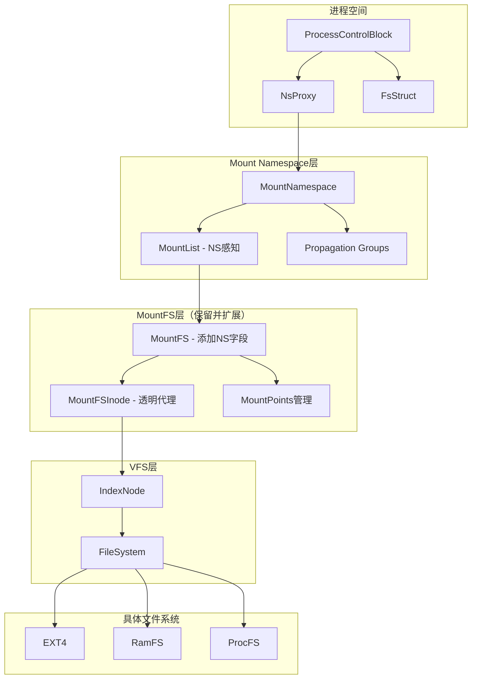

# DragonOS Mount Namespace 实现技术方案

## 1. 概述

Mount namespace是Linux命名空间的重要组成部分，它为进程提供了隔离的文件系统挂载视图。每个mount namespace都有自己独立的挂载树，进程在其namespace中的挂载操作不会影响其他namespace。

### 1.1 目标
- 实现完整的mount namespace功能
- 支持mount propagation（shared、private、slave、unbindable）
- 与现有VFS系统无缝集成
- 提供完整的clone/unshare支持

### 1.2 当前DragonOS状态分析

基于对源码的分析，DragonOS已经具备以下基础设施：

**优势：**
- 完善的namespace架构（`kernel/src/process/namespace/`）
- 现有的PID namespace实现可作为参考
- **成熟的MountFS实现**：完美处理文件系统边界黏合
- VFS和挂载系统基础完善（`MOUNT_LIST`）
- 进程文件系统状态管理（`FsStruct`）

**MountFS的核心价值：**
- **透明代理机制**：MountFSInode作为代理层，透明转发所有IndexNode操作
- **挂载点管理**：通过BTreeMap精确管理每个inode的挂载关系
- **递归挂载支持**：支持在已挂载文件系统上再次挂载
- **路径解析优化**：实现跨文件系统的无缝访问

**需要改进：**
- 当前挂载系统是全局的，缺乏namespace隔离
- 路径解析直接使用全局`ROOT_INODE()`
- 缺乏mount propagation机制
- `NsProxy`中mount namespace字段被注释

**⚠️ 重要决策：保留并扩展MountFS，而非替换它**

经过深入分析，MountFS是DragonOS中处理文件系统边界的核心组件，它的设计非常优秀。完全替换它会带来巨大风险和工作量。我们应该在MountFS基础上添加namespace支持。

## 2. 整体架构设计

### 2.1 核心设计理念

**在MountFS基础上添加namespace层，而不是替换MountFS**



### 2.2 核心数据结构

```rust
// kernel/src/process/namespace/mount_namespace.rs

/// Mount namespace结构 - 管理挂载树和propagation
pub struct MountNamespace {
    ns_common: NsCommon,
    self_ref: Weak<MountNamespace>,
    parent: Option<Weak<MountNamespace>>,
    user_ns: Arc<UserNamespace>,
    
    inner: SpinLock<InnerMountNamespace>,
}

struct InnerMountNamespace {
    /// 当前namespace的根MountFS（复用现有实现）
    root_mountfs: Arc<MountFS>,
    /// namespace特有的挂载列表
    mount_list: MountList,
    /// propagation组管理
    shared_groups: HashMap<u32, SharedGroup>,
    /// 挂载ID分配器
    mount_id_allocator: IdAllocator,
    dead: bool,
}

/// 共享组，用于管理shared propagation
struct SharedGroup {
    group_id: u32,
    members: Vec<Weak<MountFS>>,
}

/// Propagation元数据 - 扩展到MountFS
#[derive(Debug, Clone, Copy, PartialEq)]
pub enum PropagationType {
    Private,
    Shared,
    Slave, 
    Unbindable,
}

/// Mount propagation信息
pub struct MountPropagation {
    pub prop_type: PropagationType,
    pub shared_group_id: Option<u32>,
    pub master: Option<Weak<MountFS>>,
}
```

```rust
// kernel/src/filesystem/vfs/mount.rs - 扩展现有MountFS

/// 扩展MountFS，添加namespace和propagation支持
#[derive(Debug)]
pub struct MountFS {
    // === 保留现有字段 ===
    inner_filesystem: Arc<dyn FileSystem>,
    mountpoints: SpinLock<BTreeMap<InodeId, Arc<MountFS>>>,
    self_mountpoint: Option<Arc<MountFSInode>>,
    self_ref: Weak<MountFS>,
    
    // === 新增字段 ===
    /// 所属的mount namespace
    namespace: Weak<MountNamespace>,
    /// propagation信息
    propagation: RwLock<MountPropagation>,
    /// 挂载ID（用于内核调试和/proc输出）
    mount_id: u32,
}

// MountFSInode保持不变 - 继续作为透明代理
```

## 3. 详细实现方案

### 3.1 MountNamespace实现

```rust
impl MountNamespace {
    /// 创建root mount namespace
    pub fn new_root() -> Arc<Self> {
        // 使用现有的全局ROOT_INODE创建root MountFS
        let root_fs = produce_fs("ramfs", "", None).unwrap();
        let root_mountfs = MountFS::new_with_namespace(
            root_fs,
            None,
            Weak::new(), // 稍后设置
            MountPropagation::new_private(),
            0, // root mount id
        );
        
        Arc::new_cyclic(|self_ref| {
            // 设置MountFS的namespace引用
            root_mountfs.set_namespace(self_ref.clone());
            
            Self {
                ns_common: NsCommon::new(0, NamespaceType::Mount),
                self_ref: self_ref.clone(),
                parent: None,
                user_ns: INIT_USER_NAMESPACE.clone(),
                inner: SpinLock::new(InnerMountNamespace {
                    root_mountfs,
                    mount_list: MountList::new(),
                    shared_groups: HashMap::new(),
                    mount_id_allocator: IdAllocator::new(1, u32::MAX).unwrap(),
                    dead: false,
                }),
            }
        })
    }
    
    /// 复制mount namespace（用于CLONE_NEWNS）
    pub fn copy_mount_ns(
        &self,
        clone_flags: &CloneFlags,
        user_ns: Arc<UserNamespace>,
    ) -> Result<Arc<Self>, SystemError> {
        if !clone_flags.contains(CloneFlags::CLONE_NEWNS) {
            return Ok(self.self_ref.upgrade().unwrap());
        }
        
        self.create_mount_namespace(user_ns)
    }
    
    /// 获取namespace感知的挂载列表
    pub fn mount_list(&self) -> &MountList {
        &self.inner().mount_list
    }
    
    /// 获取当前namespace的根MountFS
    pub fn root_mountfs(&self) -> Arc<MountFS> {
        self.inner().root_mountfs.clone()
    }
}
```

### 3.2 扩展MountFS支持namespace

```rust
impl MountFS {
    /// 新的构造函数，支持namespace
    pub fn new_with_namespace(
        inner_filesystem: Arc<dyn FileSystem>,
        self_mountpoint: Option<Arc<MountFSInode>>,
        namespace: Weak<MountNamespace>,
        propagation: MountPropagation,
        mount_id: u32,
    ) -> Arc<Self> {
        Arc::new_cyclic(|self_ref| MountFS {
            inner_filesystem,
            mountpoints: SpinLock::new(BTreeMap::new()),
            self_mountpoint,
            self_ref: self_ref.clone(),
            namespace,
            propagation: RwLock::new(propagation),
            mount_id,
        })
    }
    
    /// 保持向后兼容的构造函数
    pub fn new(
        inner_filesystem: Arc<dyn FileSystem>,
        self_mountpoint: Option<Arc<MountFSInode>>,
    ) -> Arc<Self> {
        // 使用当前进程的mount namespace
        let current_ns = ProcessManager::current_pcb()
            .nsproxy()
            .mount_ns
            .clone();
        let mount_id = current_ns.inner().mount_id_allocator.alloc()
            .unwrap_or(0);
            
        Self::new_with_namespace(
            inner_filesystem,
            self_mountpoint,
            Arc::downgrade(&current_ns),
            MountPropagation::new_private(),
            mount_id,
        )
    }
    
    /// 设置propagation类型
    pub fn set_propagation(&self, prop_type: PropagationType) -> Result<(), SystemError> {
        let mut prop = self.propagation.write();
        
        match prop_type {
            PropagationType::Shared => {
                // 加入或创建共享组
                if let Some(ns) = self.namespace.upgrade() {
                    let group_id = ns.create_or_join_shared_group(self.self_ref.clone())?;
                    prop.shared_group_id = Some(group_id);
                }
            },
            PropagationType::Private => {
                // 退出共享组
                if let Some(group_id) = prop.shared_group_id.take() {
                    if let Some(ns) = self.namespace.upgrade() {
                        ns.leave_shared_group(group_id, &self.self_ref)?;
                    }
                }
            },
            _ => {
                // 其他类型的处理
            }
        }
        
        prop.prop_type = prop_type;
        Ok(())
    }
}
```

### 3.3 Propagation实现

```rust
impl MountNamespace {
    /// 处理挂载传播
    fn handle_mount_propagation(
        &self,
        source_mount: &Arc<MountFS>,
        target_path: &str,
        new_mount: &Arc<MountFS>,
    ) -> Result<(), SystemError> {
        let prop = source_mount.propagation.read();
        
        match prop.prop_type {
            PropagationType::Shared => {
                // 传播到同一共享组的所有挂载点
                if let Some(group_id) = prop.shared_group_id {
                    self.propagate_to_shared_group(group_id, target_path, new_mount)?;
                }
            },
            PropagationType::Slave => {
                // 从属挂载不向外传播
            },
            PropagationType::Private => {
                // 私有挂载不传播
            },
            PropagationType::Unbindable => {
                // 不可绑定
                return Err(SystemError::EINVAL);
            },
        }
        
        Ok(())
    }
    
    /// 传播到共享组
    fn propagate_to_shared_group(
        &self,
        group_id: u32,
        target_path: &str,
        new_mount: &Arc<MountFS>,
    ) -> Result<(), SystemError> {
        let inner = self.inner();
        if let Some(group) = inner.shared_groups.get(&group_id) {
            for member_weak in &group.members {
                if let Some(member) = member_weak.upgrade() {
                    // 在每个成员上创建相应的挂载
                    // 这里需要实现具体的传播逻辑
                }
            }
        }
        Ok(())
    }
}
```

### 3.4 路径解析修改（最小化改动）

```rust
// kernel/src/filesystem/vfs/utils.rs

/// 修改为namespace感知，但保持接口兼容
pub fn user_path_at(
    pcb: &Arc<ProcessControlBlock>,
    dirfd: i32,
    path: &str,
) -> Result<(Arc<dyn IndexNode>, String), SystemError> {
    // 获取当前进程的mount namespace根节点
    let mount_ns = pcb.nsproxy().mount_ns.clone();
    let root_mountfs = mount_ns.root_mountfs();
    let mut inode = root_mountfs.mountpoint_root_inode();
    
    let ret_path;
    
    if path.is_empty() || path.as_bytes()[0] != b'/' {
        if dirfd != AtFlags::AT_FDCWD.bits() {
            let binding = pcb.fd_table();
            let fd_table_guard = binding.read();
            let file = fd_table_guard
                .get_file_by_fd(dirfd)
                .ok_or(SystemError::EBADF)?;

            drop(fd_table_guard);

            if file.file_type() != FileType::Dir {
                return Err(SystemError::ENOTDIR);
            }

            inode = file.inode();
            ret_path = String::from(path);
        } else {
            let mut cwd = pcb.basic().cwd();
            cwd.push('/');
            cwd.push_str(path);
            ret_path = cwd;
        }
    } else {
        ret_path = String::from(path);
    }

    // 返回Arc<dyn IndexNode>以保持兼容性
    Ok((inode as Arc<dyn IndexNode>, ret_path))
}
```

### 3.5 MOUNT_LIST重构

```rust
// kernel/src/filesystem/vfs/mount.rs

/// 修改全局MOUNT_LIST函数，使其namespace感知
pub fn MOUNT_LIST() -> &'static MountList {
    let current_pcb = ProcessManager::current_pcb();
    let mount_ns = current_pcb.nsproxy().mount_ns.clone();
    mount_ns.mount_list()
}

/// 为了向后兼容，保留旧的全局挂载列表
static mut GLOBAL_MOUNT_LIST: Option<Arc<MountList>> = None;

pub fn GLOBAL_MOUNT_LIST() -> &'static Arc<MountList> {
    unsafe { GLOBAL_MOUNT_LIST.as_ref().unwrap() }
}
```

## 4. 兼容性和迁移策略

### 4.1 向后兼容保证

1. **MountFS接口保持不变**：现有的`MountFS::new()`继续工作
2. **MountFSInode完全不变**：作为透明代理继续发挥作用
3. **系统调用接口不变**：mount/umount系统调用保持兼容
4. **渐进式迁移**：可以逐步启用namespace功能

### 4.2 迁移阶段

#### 第一阶段：基础设施（1周）
- [ ] 实现MountNamespace基础结构
- [ ] 扩展MountFS添加namespace字段
- [ ] 修改NsProxy集成mount namespace
- [ ] 保持现有功能完全兼容

#### 第二阶段：namespace感知（1周）
- [ ] 修改user_path_at使用namespace根节点
- [ ] 修改MOUNT_LIST函数
- [ ] 测试namespace隔离功能

#### 第三阶段：Propagation支持（2周）
- [ ] 实现propagation类型设置
- [ ] 实现shared/slave传播逻辑
- [ ] 添加mount propagation系统调用

#### 第四阶段：完善和优化（1周）
- [ ] 完整的unshare/clone支持
- [ ] 性能优化
- [ ] 测试和文档

## 5. 优势分析

### 5.1 风险控制
- **最小化改动**：充分利用现有MountFS的成熟实现
- **向后兼容**：现有代码无需修改即可继续工作
- **渐进式迁移**：可以分阶段启用功能

### 5.2 技术优势
- **复用优秀设计**：MountFS的透明代理机制非常优秀
- **保持性能**：避免了重写带来的性能回退风险
- **降低复杂性**：在现有基础上扩展比重新实现简单得多

### 5.3 维护优势
- **代码复用**：避免重复实现文件系统边界处理逻辑
- **测试复用**：现有的MountFS测试继续有效
- **调试友好**：熟悉的代码结构便于调试

## 6. 潜在挑战和解决方案

### 6.1 性能考虑
**挑战**：添加namespace查找可能影响性能
**解决方案**：
- 缓存namespace引用
- 避免频繁的weak引用升级
- 优化路径解析热路径

### 6.2 内存管理
**挑战**：引用关系更复杂，需要避免循环引用
**解决方案**：
- 继续使用weak引用模式
- 明确所有权关系
- 完善的生命周期管理

### 6.3 并发安全
**挑战**：mount namespace操作的并发安全
**解决方案**：
- 复用现有的锁策略
- 仔细设计锁的粒度
- 避免死锁风险

## 7. 总结

**核心决策：在MountFS基础上扩展，而非替换**

这个设计方案的最大优势是：
1. **风险最小**：充分利用现有成熟代码
2. **兼容性最好**：现有代码无需修改
3. **实施最快**：避免重新发明轮子
4. **维护性最好**：在熟悉的代码基础上工作

MountFS作为DragonOS中处理文件系统边界的核心组件，它的透明代理设计非常优秀。我们应该珍惜这个设计，在它的基础上添加namespace支持，而不是推倒重来。

这种方法将为DragonOS提供强大的mount namespace功能，同时保持系统的稳定性和向后兼容性。 