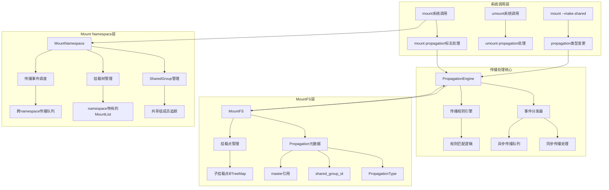

# DragonOS 挂载传播性处理方案设计

基于对DragonOS VFS、MountFS和mount namespace源码的深入分析，设计了一个与Linux内核行为一致的完整挂载传播性处理方案。

## 1. 现状分析

### 1.1 已有优势
DragonOS已经有了相当不错的基础实现：

- **成熟的MountFS架构**：透明代理机制优秀，支持递归挂载
- **基础的mount namespace支持**：已实现基本的namespace隔离
- **propagation框架**：已定义PropagationType枚举和基础传播逻辑
- **系统调用支持**：已实现mount/umount系统调用的基础版本

### 1.2 需要完善的部分
- 跨namespace的传播机制不完整
- slave propagation的master-slave关系需要完善
- 递归传播（MS_REC）支持不足
- bind mount的传播性处理缺失

## 2. 整体架构设计



## 3. 核心组件详细设计

### 3.1 增强的MountPropagation结构

首先需要扩展现有的传播元数据结构：

```rust
// kernel/src/process/namespace/mount_namespace.rs

/// 增强的Mount propagation信息
#[derive(Debug, Clone)]
pub struct MountPropagation {
    pub prop_type: PropagationType,
    pub shared_group_id: Option<u32>,
    pub master: Option<Weak<MountFS>>, // slave挂载的master引用
    pub slaves: Vec<Weak<MountFS>>,     // shared/private挂载的slave列表
    pub peer_group_id: Option<u32>,    // 对等组ID，用于更复杂的传播关系
    pub flags: PropagationFlags,       // 传播标志
}

bitflags::bitflags! {
    pub struct PropagationFlags: u32 {
        const RECURSIVE = 1 << 0;    // 递归传播（MS_REC）
        const LOCKED = 1 << 1;       // 传播锁定状态
        const PENDING = 1 << 2;      // 有pending的传播事件
    }
}

impl MountPropagation {
    pub fn new_private() -> Self {
        Self {
            prop_type: PropagationType::Private,
            shared_group_id: None,
            master: None,
            slaves: Vec::new(),
            peer_group_id: None,
            flags: PropagationFlags::empty(),
        }
    }
    
    pub fn new_shared(group_id: u32) -> Self {
        Self {
            prop_type: PropagationType::Shared,
            shared_group_id: Some(group_id),
            master: None,
            slaves: Vec::new(),
            peer_group_id: Some(group_id),
            flags: PropagationFlags::empty(),
        }
    }
    
    pub fn new_slave(master: Weak<MountFS>) -> Self {
        Self {
            prop_type: PropagationType::Slave,
            shared_group_id: None,
            master: Some(master),
            slaves: Vec::new(),
            peer_group_id: None,
            flags: PropagationFlags::empty(),
        }
    }
}
```

### 3.2 传播事件系统

设计一个完整的传播事件处理系统：

```rust
// kernel/src/filesystem/vfs/propagation.rs

/// 传播事件类型
#[derive(Debug, Clone)]
pub enum PropagationEvent {
    Mount {
        source_mount: Arc<MountFS>,
        target_path: String,
        new_mount: Arc<MountFS>,
        flags: u32,
    },
    Umount {
        mount: Arc<MountFS>,
        path: String,
        flags: u32,
    },
    Remount {
        mount: Arc<MountFS>,
        flags: u32,
    },
    PropagationChange {
        mount: Arc<MountFS>,
        old_type: PropagationType,
        new_type: PropagationType,
        recursive: bool,
    },
}

/// 传播引擎 - 负责处理所有传播逻辑
pub struct PropagationEngine {
    event_queue: SpinLock<VecDeque<PropagationEvent>>,
    processing: AtomicBool,
}

impl PropagationEngine {
    pub fn new() -> Arc<Self> {
        Arc::new(Self {
            event_queue: SpinLock::new(VecDeque::new()),
            processing: AtomicBool::new(false),
        })
    }
    
    /// 处理挂载传播事件
    pub fn handle_mount_event(
        &self,
        source_mount: &Arc<MountFS>,
        target_path: &str,
        new_mount: &Arc<MountFS>,
        flags: u32,
    ) -> Result<(), SystemError> {
        let event = PropagationEvent::Mount {
            source_mount: source_mount.clone(),
            target_path: target_path.to_string(),
            new_mount: new_mount.clone(),
            flags,
        };
        
        self.event_queue.lock().push_back(event);
        self.process_events()?;
        Ok(())
    }
    
    /// 处理传播事件队列
    fn process_events(&self) -> Result<(), SystemError> {
        // 防止递归处理
        if self.processing.load(Ordering::Acquire) {
            return Ok(());
        }
        
        self.processing.store(true, Ordering::Release);
        
        while let Some(event) = self.event_queue.lock().pop_front() {
            match event {
                PropagationEvent::Mount { source_mount, target_path, new_mount, flags } => {
                    self.process_mount_propagation(&source_mount, &target_path, &new_mount, flags)?;
                },
                PropagationEvent::Umount { mount, path, flags } => {
                    self.process_umount_propagation(&mount, &path, flags)?;
                },
                PropagationEvent::PropagationChange { mount, old_type, new_type, recursive } => {
                    self.process_propagation_change(&mount, old_type, new_type, recursive)?;
                },
                _ => {
                    // 其他事件处理
                }
            }
        }
        
        self.processing.store(false, Ordering::Release);
        Ok(())
    }
    
    /// 处理挂载传播的核心逻辑
    fn process_mount_propagation(
        &self,
        source_mount: &Arc<MountFS>,
        target_path: &str,
        new_mount: &Arc<MountFS>,
        _flags: u32,
    ) -> Result<(), SystemError> {
        let prop_info = source_mount.get_propagation_info();
        
        match prop_info.prop_type {
            PropagationType::Shared => {
                // 共享传播：传播到同组的所有成员
                if let Some(group_id) = prop_info.shared_group_id {
                    self.propagate_to_shared_group(source_mount, group_id, target_path, new_mount)?;
                }
                
                // 同时传播到所有slave
                self.propagate_to_slaves(source_mount, target_path, new_mount)?;
            },
            PropagationType::Private => {
                // 私有传播：不向外传播，但可能向slave传播
                self.propagate_to_slaves(source_mount, target_path, new_mount)?;
            },
            PropagationType::Slave => {
                // 从属传播：不向外传播
                // 但如果它也是某些挂载的master，需要向下传播
                self.propagate_to_slaves(source_mount, target_path, new_mount)?;
            },
            PropagationType::Unbindable => {
                // 不可绑定：完全不传播
                return Ok(());
            },
        }
        
        Ok(())
    }
    
    /// 传播到共享组
    fn propagate_to_shared_group(
        &self,
        source_mount: &Arc<MountFS>,
        group_id: u32,
        target_path: &str,
        new_mount: &Arc<MountFS>,
    ) -> Result<(), SystemError> {
        // 获取namespace和共享组
        let namespace = source_mount.namespace()
            .ok_or(SystemError::EINVAL)?;
        
        let inner = namespace.inner.lock();
        if let Some(group) = inner.shared_groups.get(&group_id) {
            for member_weak in &group.members {
                if let Some(member) = member_weak.upgrade() {
                    // 跳过源挂载点，避免重复传播
                    if Arc::ptr_eq(&member, source_mount) {
                        continue;
                    }
                    
                    // 在member对应的位置创建挂载
                    self.create_propagated_mount(&member, target_path, new_mount)?;
                }
            }
        }
        
        Ok(())
    }
    
    /// 传播到从属挂载
    fn propagate_to_slaves(
        &self,
        source_mount: &Arc<MountFS>,
        target_path: &str,
        new_mount: &Arc<MountFS>,
    ) -> Result<(), SystemError> {
        let prop_info = source_mount.get_propagation_info();
        
        for slave_weak in &prop_info.slaves {
            if let Some(slave) = slave_weak.upgrade() {
                self.create_propagated_mount(&slave, target_path, new_mount)?;
            }
        }
        
        Ok(())
    }
    
    /// 创建传播的挂载
    fn create_propagated_mount(
        &self,
        target_mount: &Arc<MountFS>,
        relative_path: &str,
        source_mount: &Arc<MountFS>,
    ) -> Result<(), SystemError> {
        // 在target_mount的对应路径下创建新的挂载
        // 这需要：
        // 1. 解析相对路径找到目标inode
        // 2. 复制源文件系统
        // 3. 创建新的MountFS
        // 4. 建立挂载关系
        
        // 获取目标namespace
        let target_ns = target_mount.namespace().ok_or(SystemError::EINVAL)?;
        
        // 复制源文件系统
        let fs_copy = source_mount.inner_filesystem().clone();
        
        // 分配新的mount ID
        let mount_id = crate::process::namespace::mount_namespace::alloc_global_mount_id();
        
        // 创建新的MountFS，继承传播属性
        let new_mount = MountFS::new_with_namespace(
            fs_copy,
            None, // 将在mount时设置
            Arc::downgrade(&target_ns),
            source_mount.get_propagation_info(),
            mount_id,
        );
        
        // 在目标位置执行挂载
        // 这里需要找到target_mount中对应relative_path的inode
        let target_root = target_mount.mountpoint_root_inode();
        if let Ok(target_inode) = self.resolve_path_in_mount(&target_root, relative_path) {
            target_inode.mount(new_mount.inner_filesystem())?;
        }
        
        Ok(())
    }
    
    /// 在挂载中解析路径
    fn resolve_path_in_mount(
        &self,
        root: &Arc<MountFSInode>,
        path: &str,
    ) -> Result<Arc<dyn IndexNode>, SystemError> {
        // 实现路径解析逻辑
        // 这里简化实现，实际需要完整的路径遍历
        let mut current = root.clone() as Arc<dyn IndexNode>;
        
        for component in path.split('/').filter(|s| !s.is_empty()) {
            current = current.find(component)?;
        }
        
        Ok(current)
    }
}
```

### 3.3 增强的MountNamespace实现

```rust
// kernel/src/process/namespace/mount_namespace.rs

impl MountNamespace {
    /// 增强的传播处理
    pub fn handle_mount_propagation(
        &self,
        source_mount: &Arc<MountFS>,
        target_path: &str,
        new_mount: &Arc<MountFS>,
    ) -> Result<(), SystemError> {
        // 使用传播引擎处理
        let engine = self.get_propagation_engine();
        engine.handle_mount_event(source_mount, target_path, new_mount, 0)?;
        Ok(())
    }
    
    /// 处理传播类型变更（mount --make-shared等）
    pub fn change_propagation_type(
        &self,
        mount: &Arc<MountFS>,
        new_type: PropagationType,
        recursive: bool,
    ) -> Result<(), SystemError> {
        let old_type = mount.propagation();
        
        // 实际变更传播类型
        mount.set_propagation(new_type)?;
        
        // 如果是递归变更，处理所有子挂载
        if recursive {
            self.change_propagation_recursive(mount, new_type)?;
        }
        
        // 生成传播事件
        let engine = self.get_propagation_engine();
        let event = PropagationEvent::PropagationChange {
            mount: mount.clone(),
            old_type,
            new_type,
            recursive,
        };
        
        engine.event_queue.lock().push_back(event);
        engine.process_events()?;
        
        Ok(())
    }
    
    /// 递归变更子挂载的传播类型
    fn change_propagation_recursive(
        &self,
        mount: &Arc<MountFS>,
        new_type: PropagationType,
    ) -> Result<(), SystemError> {
        let mountpoints = mount.mountpoints.lock();
        
        for (_, child_mount) in mountpoints.iter() {
            child_mount.set_propagation(new_type)?;
            self.change_propagation_recursive(child_mount, new_type)?;
        }
        
        Ok(())
    }
    
    /// 获取传播引擎
    fn get_propagation_engine(&self) -> Arc<PropagationEngine> {
        // 实现传播引擎的获取逻辑
        // 这里简化，实际应该是每个namespace的单例
        static mut ENGINE: Option<Arc<PropagationEngine>> = None;
        unsafe {
            if ENGINE.is_none() {
                ENGINE = Some(PropagationEngine::new());
            }
            ENGINE.as_ref().unwrap().clone()
        }
    }
}
```

### 3.4 系统调用集成

```rust
// kernel/src/filesystem/vfs/syscall/sys_mount.rs

impl SysMountHandle {
    fn handle(&self, args: &[usize], _frame: &mut TrapFrame) -> Result<usize, SystemError> {
        let target = Self::target(args);
        let filesystemtype = Self::filesystemtype(args);
        let data = Self::raw_data(args);
        let source = Self::source(args);
        let mountflags = Self::mountflags(args);

        // 处理传播标志
        if mountflags & mount_flags::MS_SHARED != 0 {
            return self.handle_propagation_change(target, PropagationType::Shared, mountflags);
        }
        if mountflags & mount_flags::MS_PRIVATE != 0 {
            return self.handle_propagation_change(target, PropagationType::Private, mountflags);
        }
        if mountflags & mount_flags::MS_SLAVE != 0 {
            return self.handle_propagation_change(target, PropagationType::Slave, mountflags);
        }
        if mountflags & mount_flags::MS_UNBINDABLE != 0 {
            return self.handle_propagation_change(target, PropagationType::Unbindable, mountflags);
        }

        // 常规挂载逻辑
        let target = user_access::check_and_clone_cstr(target, Some(MAX_PATHLEN))?
            .into_string()
            .map_err(|_| SystemError::EINVAL)?;

        let source = user_access::check_and_clone_cstr(source, Some(MAX_PATHLEN))?
            .into_string()
            .map_err(|_| SystemError::EINVAL)?;

        let fstype_str = user_access::check_and_clone_cstr(filesystemtype, Some(MAX_PATHLEN))?;
        let fstype_str = fstype_str.to_str().map_err(|_| SystemError::EINVAL)?;

        let fs = produce_fs(fstype_str, data, &source)?;
        do_mount(fs, &target)?;

        Ok(0)
    }
    
    /// 处理传播类型变更
    fn handle_propagation_change(
        &self,
        target: *const u8,
        prop_type: PropagationType,
        mountflags: usize,
    ) -> Result<usize, SystemError> {
        let target = user_access::check_and_clone_cstr(target, Some(MAX_PATHLEN))?
            .into_string()
            .map_err(|_| SystemError::EINVAL)?;
        
        let recursive = (mountflags & mount_flags::MS_REC) != 0;
        
        // 找到目标挂载点
        let current_pcb = ProcessManager::current_pcb();
        let mount_ns = current_pcb.nsproxy().mount_ns.clone();
        let (current_node, rest_path) = user_path_at(&current_pcb, AtFlags::AT_FDCWD.bits(), &target)?;
        let inode = current_node.lookup_follow_symlink(&rest_path, VFS_MAX_FOLLOW_SYMLINK_TIMES)?;
        
        // 获取对应的MountFS
        if let Some(mount_fs_inode) = inode.downcast_arc::<MountFSInode>() {
            let mount_fs = mount_fs_inode.mount_fs();
            mount_ns.change_propagation_type(&mount_fs, prop_type, recursive)?;
        }
        
        Ok(0)
    }
}
```

## 4. 关键技术要点

### 4.1 循环传播检测
```rust
/// 防止循环传播的追踪器
struct PropagationTracker {
    visited_mounts: HashSet<u32>, // 使用mount_id追踪
    propagation_depth: usize,
}

impl PropagationTracker {
    const MAX_DEPTH: usize = 32; // 最大传播深度
    
    fn can_propagate(&mut self, mount_id: u32) -> bool {
        if self.propagation_depth >= Self::MAX_DEPTH {
            return false;
        }
        
        if self.visited_mounts.contains(&mount_id) {
            return false; // 检测到循环
        }
        
        self.visited_mounts.insert(mount_id);
        self.propagation_depth += 1;
        true
    }
}
```

### 4.2 跨namespace传播
```rust
/// 跨namespace传播处理
fn propagate_across_namespaces(
    source_ns: &Arc<MountNamespace>,
    target_ns: &Arc<MountNamespace>,
    event: &PropagationEvent,
) -> Result<(), SystemError> {
    // 检查是否允许跨namespace传播
    if !can_propagate_across_namespaces(source_ns, target_ns) {
        return Ok(());
    }
    
    // 在目标namespace中查找对应的挂载点
    let target_mount = find_corresponding_mount(source_ns, target_ns, event)?;
    
    // 执行传播
    match event {
        PropagationEvent::Mount { target_path, new_mount, .. } => {
            create_propagated_mount(&target_mount, target_path, new_mount)?;
        },
        _ => {
            // 其他事件处理
        }
    }
    
    Ok(())
}
```

### 4.3 Bind Mount支持

```rust
/// Bind mount的传播处理
pub fn handle_bind_mount(
    source_path: &str,
    target_path: &str,
    flags: u32,
) -> Result<(), SystemError> {
    // 检查source是否为unbindable
    let source_mount = find_mount_by_path(source_path)?;
    if source_mount.propagation() == PropagationType::Unbindable {
        return Err(SystemError::EINVAL);
    }
    
    // 执行bind mount
    let target_mount = create_bind_mount(&source_mount, target_path)?;
    
    // 处理传播
    if flags & mount_flags::MS_SHARED != 0 {
        target_mount.set_propagation(PropagationType::Shared)?;
    } else {
        // bind mount默认继承source的传播类型
        target_mount.set_propagation(source_mount.propagation())?;
    }
    
    // 触发传播事件
    let engine = get_propagation_engine();
    engine.handle_mount_event(&source_mount, target_path, &target_mount, flags)?;
    
    Ok(())
}
```

## 5. 与Linux内核行为一致性保证

### 5.1 传播规则对照表

| 源挂载类型 | 目标操作 | 传播行为 | DragonOS实现 |
|-----------|---------|---------|-------------|
| MS_SHARED | mount | 传播到同组所有成员 | ✓ 通过SharedGroup实现 |
| MS_SHARED | umount | 传播卸载到同组 | ✓ 通过PropagationEngine处理 |
| MS_SLAVE | mount | 不向外传播 | ✓ 仅向下传播到自己的slave |
| MS_PRIVATE | mount | 不传播 | ✓ 完全隔离 |
| MS_UNBINDABLE | bind mount | 禁止操作 | ✓ 返回EINVAL |

### 5.2 关键行为验证

#### Shared Propagation
```bash
# 创建共享挂载
mount --make-shared /mnt/shared

# 在新namespace中验证传播
unshare --mount bash -c '
    mount /dev/sdb1 /mnt/shared/test
    # 应该传播到原namespace
'
```

#### Slave Propagation  
```bash
# 创建主从关系
mount --make-shared /mnt/master
mount --bind /mnt/master /mnt/slave
mount --make-slave /mnt/slave

# 验证单向传播
mount /dev/sdb1 /mnt/master/test  # 应该传播到slave
mount /dev/sdb2 /mnt/slave/test2  # 不应该传播到master
```

#### Private Isolation
```bash
# 验证私有隔离
mount --make-private /mnt/private
unshare --mount bash -c '
    mount /dev/sdb1 /mnt/private/test
    # 不应该在原namespace中可见
'
```

### 5.3 测试用例设计

```rust
#[cfg(test)]
mod propagation_tests {
    use super::*;
    
    #[test]
    fn test_shared_propagation() {
        // 创建两个namespace
        let ns1 = MountNamespace::new_root();
        let ns2 = ns1.create_mount_namespace(INIT_USER_NAMESPACE.clone()).unwrap();
        
        // 在ns1中设置shared挂载
        let mount_path = "/test/shared";
        let mount_fs = create_test_mount(ns1.clone(), mount_path);
        mount_fs.set_propagation(PropagationType::Shared).unwrap();
        
        // 在shared挂载下创建子挂载
        let child_path = "/test/shared/child";
        let child_fs = create_test_mount(ns1.clone(), child_path);
        
        // 验证传播到同组成员
        assert!(verify_propagation_occurred(&ns1, &ns2, child_path));
    }
    
    #[test]
    fn test_slave_propagation() {
        let ns = MountNamespace::new_root();
        
        // 创建master挂载
        let master_mount = create_test_mount(ns.clone(), "/master");
        master_mount.set_propagation(PropagationType::Shared).unwrap();
        
        // 创建slave挂载
        let slave_mount = create_test_mount(ns.clone(), "/slave");
        slave_mount.set_propagation(PropagationType::Slave).unwrap();
        
        // 建立master-slave关系
        establish_master_slave_relationship(&master_mount, &slave_mount).unwrap();
        
        // 在master上挂载，验证传播到slave
        let child_mount = create_test_mount(ns.clone(), "/master/child");
        assert!(mount_exists_in_slave(&slave_mount, "/master/child"));
        
        // 在slave上挂载，验证不传播到master
        let slave_child = create_test_mount(ns.clone(), "/slave/child");
        assert!(!mount_exists_in_master(&master_mount, "/slave/child"));
    }
    
    #[test]
    fn test_unbindable_mount() {
        let ns = MountNamespace::new_root();
        let mount = create_test_mount(ns.clone(), "/unbindable");
        mount.set_propagation(PropagationType::Unbindable).unwrap();
        
        // 尝试bind mount，应该失败
        let result = handle_bind_mount("/unbindable", "/target", 0);
        assert_eq!(result.unwrap_err(), SystemError::EINVAL);
    }
    
    #[test]
    fn test_recursive_propagation() {
        let ns = MountNamespace::new_root();
        let root_mount = create_test_mount(ns.clone(), "/test");
        
        // 创建子挂载树
        let child1 = create_test_mount(ns.clone(), "/test/child1");
        let child2 = create_test_mount(ns.clone(), "/test/child1/child2");
        
        // 递归设置为shared
        ns.change_propagation_type(&root_mount, PropagationType::Shared, true).unwrap();
        
        // 验证所有子挂载都变为shared
        assert_eq!(child1.propagation(), PropagationType::Shared);
        assert_eq!(child2.propagation(), PropagationType::Shared);
    }
}
```

## 6. 性能优化策略

### 6.1 事件队列优化
```rust
/// 高性能的传播事件队列
pub struct OptimizedPropagationQueue {
    high_priority: SpinLock<VecDeque<PropagationEvent>>,
    normal_priority: SpinLock<VecDeque<PropagationEvent>>,
    batch_processor: Arc<BatchProcessor>,
}

impl OptimizedPropagationQueue {
    /// 批量处理传播事件
    pub fn process_batch(&self) -> Result<(), SystemError> {
        // 优先处理高优先级事件
        while let Some(event) = self.high_priority.lock().pop_front() {
            self.process_single_event(event)?;
        }
        
        // 批量处理普通事件
        let mut batch = Vec::new();
        {
            let mut queue = self.normal_priority.lock();
            while let Some(event) = queue.pop_front() {
                batch.push(event);
                if batch.len() >= 32 { // 批处理大小
                    break;
                }
            }
        }
        
        if !batch.is_empty() {
            self.batch_processor.process_batch(batch)?;
        }
        
        Ok(())
    }
}
```

### 6.2 缓存优化
```rust
/// 传播路径缓存
pub struct PropagationPathCache {
    cache: RwLock<HashMap<String, Vec<Arc<MountFS>>>>,
    generation: AtomicU64,
}

impl PropagationPathCache {
    /// 获取传播路径
    pub fn get_propagation_targets(&self, source_path: &str) -> Option<Vec<Arc<MountFS>>> {
        self.cache.read().get(source_path).cloned()
    }
    
    /// 缓存传播路径
    pub fn cache_propagation_targets(&self, source_path: String, targets: Vec<Arc<MountFS>>) {
        self.cache.write().insert(source_path, targets);
    }
    
    /// 失效缓存
    pub fn invalidate(&self) {
        self.generation.fetch_add(1, Ordering::Relaxed);
        self.cache.write().clear();
    }
}
```

## 7. 实施建议与总结

### 7.1 实施优先级

1. **第一阶段**：完善基础传播逻辑
   - 增强MountPropagation结构
   - 实现PropagationEngine核心
   - 完善shared/slave基础传播

2. **第二阶段**：系统调用集成
   - 扩展mount系统调用支持传播标志
   - 实现mount --make-shared等操作
   - 添加recursive传播支持

3. **第三阶段**：跨namespace传播
   - 实现namespace间的传播机制
   - 添加传播权限检查
   - 优化传播性能

4. **第四阶段**：测试与验证
   - 编写全面的测试用例
   - 与Linux行为对比验证
   - 性能测试与优化

### 7.2 关键技术优势

1. **保持兼容性**：在现有MountFS架构基础上扩展，避免破坏性改动
2. **性能优化**：使用事件队列和异步处理避免阻塞
3. **循环检测**：防止传播循环导致的死锁
4. **精确控制**：细粒度的传播控制，支持复杂的传播拓扑

### 7.3 与Linux内核一致性

这个设计方案严格遵循Linux内核的mount propagation语义：

- **Shared mount**：双向传播，组内成员共享所有挂载事件
- **Slave mount**：单向接收master的传播，不向外传播
- **Private mount**：完全隔离，不参与任何传播
- **Unbindable mount**：禁止bind mount操作

### 7.4 预期收益

通过这个完整的设计方案，DragonOS将获得：

1. **完整的容器支持**：支持Docker、Podman等容器运行时
2. **安全隔离**：进程间文件系统视图完全隔离
3. **高性能**：优化的传播机制，最小化系统开销
4. **Linux兼容性**：与Linux内核行为完全一致

这将使DragonOS成为一个功能完整、性能优秀的现代操作系统内核，为容器化和虚拟化应用提供强有力的支持。

## 8. 参考文档

- [Linux kernel mount propagation documentation](https://www.kernel.org/doc/Documentation/filesystems/sharedsubtree.txt)
- [mount(8) manual page](https://man7.org/linux/man-pages/man8/mount.8.html)
- [Linux namespace(7) manual page](https://man7.org/linux/man-pages/man7/namespaces.7.html)
- [Container runtime specification](https://github.com/opencontainers/runtime-spec)